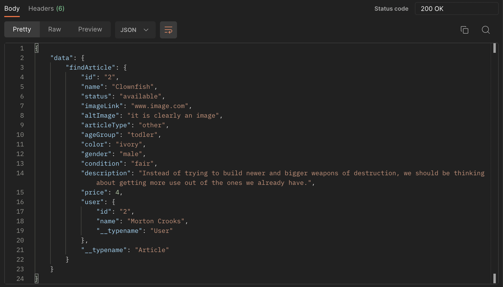
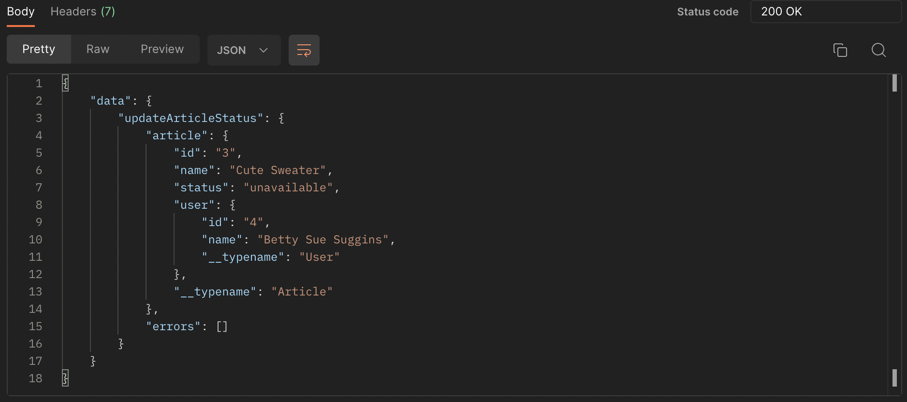

# README
## Outgrown BE

A marketplace built for those who pine, to leave pants and shirts from the past behind! <br>
Trade articles of children's clothing with like minded shoppers who see greater value in obtaining useable 
clothing for their child(ren) over hoarding piles of stuff that only serve to remind us of how dirty they had made them!

<a name="readme-top"></a>

<details>
  <summary>Table of Contents</summary>
  <ul list-style-position="inside">
    <li>
      <a href="#about-the-project">About The Project</a>
      <ul>
        <li><a href="#learning-goals">Learning Goals</a></li>
        <li><a href="#built-with">Built With</a></li>
        <li><a href="#roadmap">Roadmap</a></li>
      </ul>
    </li>
    <li>
      <a href="#getting-started">Getting Started</a>
      <ul>
        <li><a href="#prerequisites">Prerequisites</a></li>
        <li><a href="#installation">Installation</a></li>
      </ul>
    </li>
    <li>
      <a href="#usage">Usage</a>
      <ul>
        <li><a href="#endpoints">Endpoints</a></li>
      </ul>
    </li>
    <li>
      <a href="#contributing">Contributing</a>
      <ul>
        <li><a href="#developers">Developers</a></li>
        <li><a href="#project-managers-instructors">Project Managers-Instructors</a></li>
      </ul>
    </li>
  </ol>
</details>

## About the Project
  
  ### Production Links
  
  Project Links: <br> 
  
  [Organization](https://github.com/Outgrown)<br>
  [BackEnd Github](https://github.com/Outgrown/outgrown_be) <br>
  [FrontEnd Github](https://github.com/Outgrown/outgrown_fe) <br>
  [Try Out the App](https://outgrown.vercel.app/)<br>

  ### Learning Goals

  * Microservice integration and implementation
  * Service integration and implementation
  * Efficient API exposure
  * GraphQL integration
  * Postman Mock Server & JSON Contract

  ### Built With

  [![Ruby]][Ruby-url] [![Rails]][Rails-url][![Postgres]][Postgres-url]
  [![Postman]][Postman-url] [![Graphql]][Graphql-url] [![CircleCI]][CircleCI-url]

  ### Roadmap
  <details>
    <summary>Done</summary>
    - [x] Add Readme<br>
    - [x] Readme: Outlines the learning goals<br>
    - [x] Readme: Add back to top links<br>
    - [x] Readme: Clone and Setup<br>
    - [x] Readme: Users Get API keys<br>
    - [x] Readme: Happy Path Endpoint Use<br>
    - [x] Setup Repo and Push to Github<br>
    - [x] Queries: Users<br>
    - [x] Queries: Articles<br>
    - [x] Mutations: Users<br>
    - [x] Mutations: Articles<br>
    - [x] Testing: Queries<br>
    - [x] Testing: Mutations<br>
  </details>
  <details>
    <summary>In Progress</summary>
    - [ ] Completion Party
  </details>

  <p align="right">(<a href="#readme-top">back to top</a>)</p>

## Getting Started

  ### Prerequisites

  * Ruby 2.7.4
  * Rails 5.2.8

  ### Installation

  _Below are instructions for forking and cloning this repo_

  1. Clone the repo
  ```sh
  git clone git@github.com:Outgrown/outgrown_be.git
  ```
  2. Install gems
  ```sh
  bundle install
  ```
  3. Setup the database
  ```js
  rails db:{create,migrate}
  ```
  4. Run RSpec tests
  ```sh
  bundle exec rspec
  ```

  <p align="right">(<a href="#readme-top">back to top</a>)</p>

## Usage

  ### Endpoints
  
  ### Articles

  <details>
  <summary>All Articles</summary><br>
  
  ### All Articles: Query
  ```js
  query allArticles ($limit: Int) {
    allArticles (limit: $limit) {
      id
      name
      status
      imageLink
      altImage
      articleType
      ageGroup
      color
      gender
      condition
      description
      price
      user {
          id
          name
          __typename
      }
      __typename
    }
  }
  ```

  Example Variables:

  ```sh
  {
    "limit": 10
  }
  ```

  Example Response:

  
  </details>

  <details>
  <summary>Create Article</summary><br>
  
  ### Create Article: Mutation
  ```js
  mutation createArticle ($article: CreateArticleInput!) {
    createArticle(input: $article) {
      article {
        id
        name
        status
        imageLink
        altImage
        articleType
        ageGroup
        color
        gender
        condition
        description
        price
        user {
            id
            name
            __typename
        }
        __typename
      }
      errors
    }
  }
  ```

  Example Variables:

  ```sh
  {
    "article": {
        "name": "Krabby hamburger costume",
        "status": 0,
        "imageLink": "img_55575761.jpg",
        "altImage": "This is an image",
        "articleType": 0,
        "ageGroup": 0,
        "color": "Crab colored",
        "gender": 0,
        "condition": 2,
        "description": "Tasty",
        "price": 5,
        "userId": 1
    }
  }
  ```

  Example Response:

  
  </details>

  <details>
  <summary>Find Article</summary><br>
  
  ### Find Article: Query
  ```js
  query findArticle($id: ID!) {
    findArticle(id: $id) {
      id
      name
      status
      imageLink
      altImage
      articleType
      ageGroup
      color
      gender
      condition
      description
      price
      user {
          id
          name
          __typename
      }
      __typename
    }
  }
  ```

  Example Variables:

  ```sh
  {
    "id": "2"
  }
  ```

  Example Response:

  
  </details>

  <details>
  <summary>Find Articles</summary><br>
  
  ### Find Articles: Query
  ```js
  query findArticles($articleType: String!, $ageGroup: String!) {
    findArticles(articleType: $articleType, ageGroup: $ageGroup) {
      id
      name
      status
      imageLink
      altImage
      articleType
      ageGroup
      color
      gender
      condition
      description
      price
      user {
          id
          name
          __typename
      }
      __typename
    }
  }
  ```

  Example Variables:

  ```sh
  {
    "articleType": "tops",
    "ageGroup": "toddler"
  }
  ```

  Example Response:

  
  </details>

  <details>
  <summary>Update Article Users</summary><br>
  
  ### Update Article Users: Mutation
  ```js
  mutation updateArticleUser ($article: UpdateArticleUserInput!) {
    updateArticleUser(input: $article) {
      article {
          id
          name
          status
          user {
              id
              name
              __typename
          }
          __typename
      }
      errors
    }
  }
  ```

  Example Variables:

  ```sh
  {
    "article": {
        "id": "3",
        "userId": "2"
    }
  }
  ```

  Example Response:

  
  </details>

  <details>
  <summary>Update Article Status</summary><br>
  
  ### Update Article Status: Mutation
  ```js
  mutation updateArticleStatus ($article: UpdateArticleStatusInput!) {
    updateArticleStatus(input: $article) {
      article {
          id
          name
          status
          user {
              id
              name
              __typename
          }
          __typename
      }
      errors
    }
  }
   ```

  Example Variables:

  ```sh
  {
    "article": {
        "id": "3",
        "status": "available"
    }
  }
  ```

  Example Response:

  
  </details>

  ### Users
 
  <details>
  <summary>All Users</summary><br>
  
  ### All Users: Query
  ```js
  query allUsers {
    allUsers {
        id
        name
        __typename
    }
  }
  ```

  Example Variables:

  ```sh
  {}
  ```

  Example Response:

  
  </details>

  <details>
  <summary>Create User</summary><br>
  
  ### Create User: Mutation
  ```js
  mutation createUser ($user: CreateUserInput!) {
    createUser(input: $user) {
      user {
          id
          name
          __typename
      }
      errors
    }
  }
  ```

  Example Variables:

  ```sh
  {
    "user": {
        "name": "Betty Sue Suggins"
    }
  }
  ```

  Example Response:

  
  </details>

  <details>
  <summary>Find User</summary><br>
  
  ### Find User: Query
  ```js
  query findUser($id: ID!) {
    findUser(id: $id) {
      id
      name
      __typename
      articles {
        id
        name
        status
        imageLink
        altImage
        articleType
        ageGroup
        color
        gender
        condition
        description
        price
        __typename
      }
    }
  }
  ```

  Example Variables:

  ```sh
  {
    "id": "1"
  }
  ```

  Example Response:

  
  </details>

  <p align="right">(<a href="#readme-top">back to top</a>)</p>

## Contributing

  Contributions are what make the open source community such an amazing place to learn, inspire, and create. Any contributions you make are **greatly appreciated**.

  If you have a suggestion that would make this better, please fork the repo and create a pull request. You can also simply open an issue with the tag "enhancement".
  Don't forget to give the project a star! Thanks again!

  1. Fork the Project
  2. Create your Feature Branch (`git checkout -b feature/AmazingFeature`)
  3. Commit your Changes (`git commit -m 'Add some AmazingFeature'`)
  4. Push to the Branch (`git push origin feature/AmazingFeature`)
  5. Open a Pull Request

  ### Developers

  <div align="center">
    
    <p align="center">
      Anthony Blackwell Tallent<br>
      <a href="https://github.com/anthonytallent">Github: anthonytallent</a><br>
      <a href="https://www.linkedin.com/in/anthonytallent/">LinkedIn: Anthony Blackwell Tallent</a>
    </p>
  </div>
  <div align="center">
    
    <p align="center">
      Brandon Gray<br>
      <a href="https://github.com/bGray88">Github: bGray88</a><br>
      <a href="https://www.linkedin.com/in/brandon-gray-67903689/">LinkedIn: Brandon Gray</a>
    </p>
  </div>
  <div align="center">
    
    <p align="center">
      William Lampke<br>
      <a href="https://github.com/WilliamLampke">Github: WilliamLampke</a><br>
      <a href="https://www.linkedin.com/in/william-lampke-b4a5b5250/">LinkedIn: William Lampke</a>
    </p>
  </div>

  <p align="right">(<a href="#readme-top">back to top</a>)</p>

  ### Project Managers-Instructors

  1. Juliet Eyraud

  <p align="right">(<a href="#readme-top">back to top</a>)</p>

  [Ruby]: https://img.shields.io/badge/-Ruby-CC342D?style=flat&logo=ruby&logoColor=white
  [Ruby-url]: https://www.ruby-lang.org/en/
  [Rails]: https://img.shields.io/badge/-Ruby%20on%20Rails-CC0000?style=flat&logo=rubyonrails&logoColor=white
  [Rails-url]: https://rubyonrails.org
  [Postgres]: https://img.shields.io/badge/-Postgres-4169E1?style=flat&logo=postgresql&logoColor=white
  [Postgres-url]: https://www.postgresql.org/
  [Postman]: https://img.shields.io/badge/-Postman-FF6C37?style=flat&logo=postman&logoColor=white
  [Postman-url]: https://www.postman.com/
  [Graphql]: https://shields.io/badge/GraphQL-e535ab?style=flat&logo=graphql&logoColor=FFF
  [Graphql-url]: https://graphql.org/
  [CircleCI]: https://img.shields.io/badge/circle%20ci-%23161616.svg?style=flat&logo=circleci&logoColor=white
  [CircleCI-url]: https://circleci.com/
